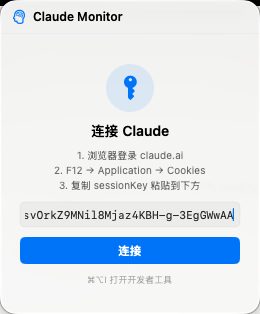
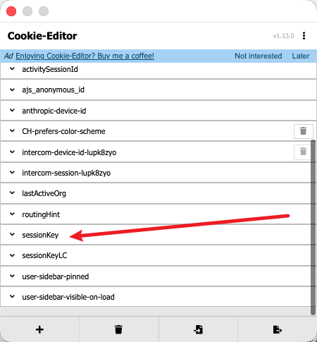

# Claude Monitor

macOS 菜单栏应用，实时显示 Claude.ai 用量（5小时会话 / 7日额度 / 今日 Tokens）。



## 功能

- **菜单栏环形图标** — 按用量变色：绿色 < 60%，黄色 60–90%，红色 ≥ 90%
- **三环面板** — 5小时会话用量、7日用量、今日实时 Token 数
- **倒计时** — 显示各额度的重置时间
- **套餐识别** — 自动显示 Pro / Max / Team 标签
- **用量提示** — 根据当前消耗给出操作建议
- **凭证安全** — `sessionKey` 存储在系统 Keychain，不落磁盘明文

## 系统要求

- macOS 14.0（Sonoma）及以上
- Xcode 16+（仅需编译时）

## 安装

### 方式一：下载编译好的包

前往 [Releases](../../releases) 页面下载最新 `.zip`，解压后将 `Claude Monitor.app` 拖入 `/Applications`。

### 方式二：从源码编译

```bash
git clone https://github.com/你的用户名/ClaudeMonitor.git
cd ClaudeMonitor
open ClaudeMonitor.xcodeproj
```

在 Xcode 中选择 `Product → Archive`，或直接运行（⌘R）。

> **注意**：首次运行需在 Xcode Signing & Capabilities 中配置你自己的 Team / Bundle ID。

## 使用方法

1. 启动应用，点击菜单栏图标
2. 按提示获取 `sessionKey`：
   - 浏览器打开 [claude.ai](https://claude.ai) 并登录
   - 安装 [Cookie-Editor](https://cookie-editor.com) 插件（或 F12 → Application → Cookies）
   - 找到 `sessionKey` 字段，复制其值

   

3. 将 `sessionKey` 粘贴到输入框，点击「连接」

## 数据来源

| 数据 | 来源 |
|------|------|
| 5小时会话 / 7日用量 | `claude.ai` 官方 API（需 sessionKey） |
| 今日 Token 数 | 本地 `buddy-tokens.json`（由 Claude Code 生成） |

## 更新凭证

`sessionKey` 过期后，面板会自动提示重新输入，无需重启应用。

点击标题栏的电源图标可主动退出登录。

## 隐私

- 所有请求直接发往 `claude.ai`，不经过任何第三方服务器
- `sessionKey` 仅存储在本机 Keychain

## License

MIT
